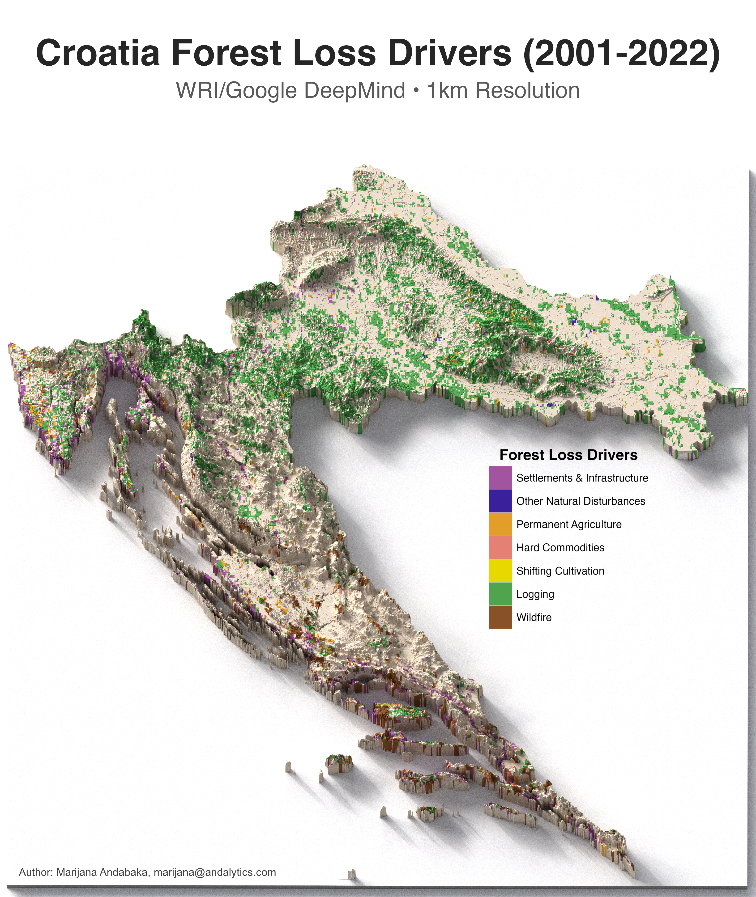

# Croatia Forest Loss Drivers (2001-2022)

 

This repository contains R code for analyzing and visualizing the dominant drivers of forest loss across Croatia using the WRI/Google DeepMind Global Drivers of Forest Loss dataset - a 1km resolution global map that classifies the direct causes of tree cover loss from 2001-2022.

## Overview

The Global Drivers of Forest Loss dataset represents a major advancement in understanding deforestation patterns worldwide. This project creates a detailed 3D visualization of Croatia's forest loss drivers using:

- **Google Earth Engine** for accessing the global drivers dataset
- **WRI/Google DeepMind classification** providing AI-powered driver attribution at 1km resolution
- **R & Rayshader** for statistical analysis and 3D terrain visualization
- **High-resolution elevation data** for realistic topographic representation

## Key Features

- **Comprehensive Driver Analysis**: Seven distinct categories of forest loss causes
- **High Spatial Resolution**: 1km grid cells providing detailed landscape patterns
- **3D Terrain Visualization**: Elevation-enhanced maps showing geographic context
- **Quantitative Results**: Area calculations and statistical summaries for each driver

## WRI/Google DeepMind Dataset

The Global Drivers of Forest Loss dataset classifies tree cover loss into seven categories based on interpretation of nearly 6,959 reference samples and training of a global neural network model. The classification achieves an overall accuracy of **90.5% ± 1.4%** globally, with **93.8% ± 3.1%** accuracy for Europe.

## Forest Loss Driver Categories

The analysis uses seven driver classifications representing the **dominant cause** of tree cover loss within each 1km grid cell:

1. **Permanent Agriculture** - Long-term conversion to crops, pasture, or tree plantations
2. **Hard Commodities** - Mining, energy infrastructure, and hydroelectric projects
3. **Shifting Cultivation** - Temporary clearing followed by forest regrowth
4. **Logging** - Forest management and timber harvesting operations
5. **Wildfire** - Fire-related tree cover loss (natural or human-caused)
6. **Settlements & Infrastructure** - Urban expansion and road development
7. **Other Natural Disturbances** - Storms, floods, landslides, and insect outbreaks

**Learn more:** [Global Forest Watch](https://www.globalforestwatch.org/) | [Research Paper](https://doi.org/10.1088/1748-9326/add606)

## Key Findings (2001-2022)

| Driver Category | Area Coverage |
|----------------|---------------|
| **Logging** | **70.6%** |
| **Settlements & Infrastructure** | **10.3%** |
| **Wildfire** | **7.2%** |
| **Permanent Agriculture** | **5.7%** |
| **Hard Commodities** | **1.5%** |
| **Other Natural Disturbances** | **0.4%** |

Croatia's forest loss pattern differs significantly from the global average, where permanent agriculture dominates (34.8% globally). The predominance of logging (70.6%) reflects Croatia's active forest management sector and sustainable forestry practices.
Technical Details

## License
MIT License - see LICENSE file for details.

## Contact

*Website: [andalytics.com](https://andalytics.com)*

*Email: [marijana@andalytics.com](mailto:marijana@andalytics.com)*

*LinkedIn: [marijana-andabaka](https://www.linkedin.com/in/marijana-andabaka/)*

---

*Need Advanced Forest Data Science?*

*I help research organizations transform their data workflows from manual to automated, providing comprehensive services from statistical analysis and modeling to spatial data integration and advanced visualizations. If you're spending days on data collection and processing instead of focusing on analysis and insights, let's talk about how custom R solutions can streamline your research pipeline.*

*My clients typically see:*

* *90% reduction in data processing time*
* *Improved accuracy through automated workflows*
* *Rigorous statistical insights that strengthen research conclusions*
* *Reproducible analyses that scale across projects*

